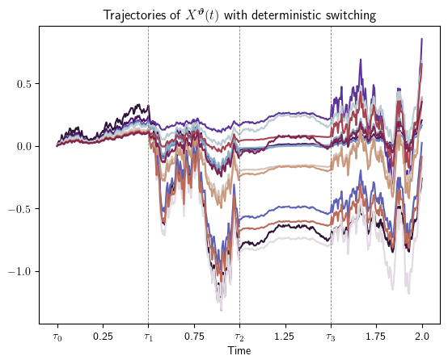
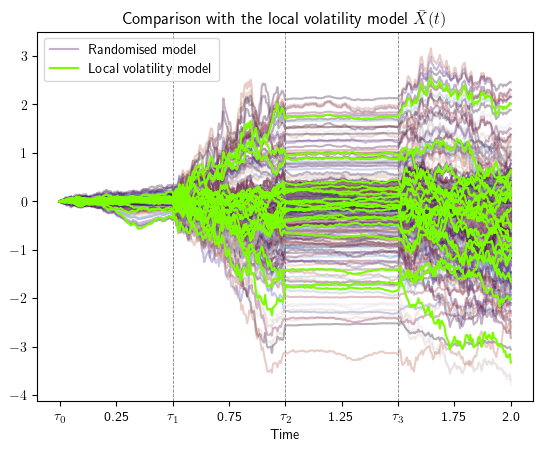
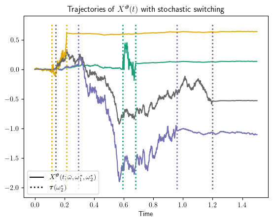
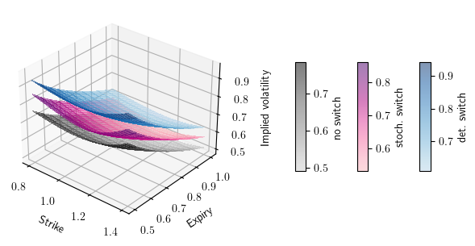
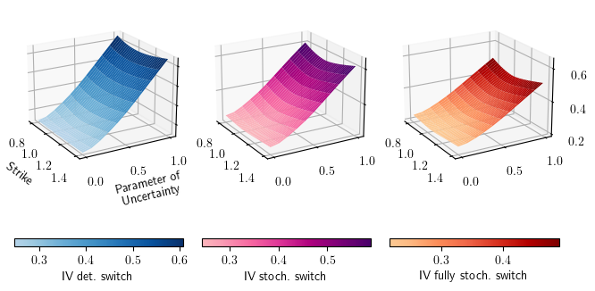

# Randomised switching processes
## About

This is an implementation of the randomised switching processes described in the article
> [1] ***Consistent asset modelling with random coefficients and switches between regimes**\
Wolf F. L., Deelstra G., Grzelak L. A. (2024) \
Mathematics and Computers in Simulation (223: 65-85)*\
[link to publication](https://doi.org/10.1016/j.matcom.2024.03.021) / preprint on the
[arXiv](https://arxiv.org/abs/2401.09955)

This code reproduces all figures contained within the article. 

This includes the characteristic functions of all randomised switching-type processes (deterministic, stochastic, fully
stochastic switching) and a suitable implementation of the COS method for pricing a European option / computing implied
volatilities.

Further included is a Monte Carlo path simulation of the following types of processes:

Randomised Ito diffusion process (e.g. logprices of an asset, randomised ABM or GBM) with the following switching dynamics:
* deterministic switching
* stochastic switching with a fixed number of switches
* fully stochastic switching
* local volatility model equivalent to deterministic switching

Code files are separated into two categories:
* **methods** which contain function definitions, 
* **scripts** which can be executed to produce various outputs found within the article [1]

## Path generation

Trajectories of randomised processes are simulated and plotted with [article_paths.py](scripts/article_paths.py).

Underlying simulation code is provided in [MonteCarlo_methods.py](methods/MonteCarlo_methods.py).

These randomised processes are equipped with deterministic and stochastic switching behaviours.
Furthermore, the localized volatility model equivalent to the deterministic switching case is simulated.  
Switching times in the stochastic case can follow any probability distribution 
described in [SciPy](https://docs.scipy.org/doc/scipy/reference/stats.html), explicit implementations are provided 
for the exponential and uniform distributions, 
as well as for switching at the quadrature points described in Section 4 of [1]. 

Note the large difference in run time between the local volatility models (described in Theorems 3.1, 4.2), 
which can be simulated much more efficiently than the simple sampling-based path simulations.

## Implied Volatility Surfaces
Creates the implied volatility surfaces of a European option under the randomised model with various types
of switching behaviour (no switching, deterministic, stochastic with fixed M, fully stochastic).

Computation of implied volatilities is based on the COS method provided in [COS_funcs.py](methods/COS_funcs.py) 
(courtesy of LA Grzelak), 
the characteristic functions of randomised switching processes are provided in [char_funcs.py](methods/char_funcs.py).
These characteristic functions rely on the quadrature point and weight calculations provided in [quadrature_calc.py](methods/quadrature_calc.py).

